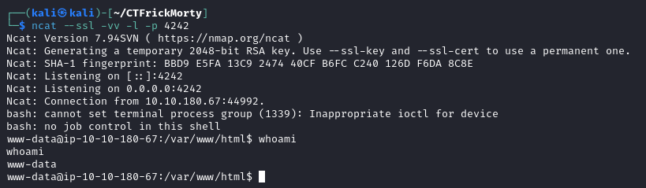

# ncat

[Home](../../../README.md)

[KaliTools](https://www.kali.org/tools/netcat/)

## Utilització

Realitzar connexió: nc [-options] hostname port[s] [ports] ... 

Escoltar connexió: nc -l -p port [-options] [hostname] [port]

### Paràmetres Comúns
 - `-l -p <port>` :S'utilitzen en combinació per escoltar en un port determinat.
 - `-u` :Utilitzem el mode UDP.
 - `-v` :Mode verbose.
 - `-c <comanda>` :Després de realitzar una connexió, executem la comanda indicada en l'equip remot.
 - `-e <programa>` :Després de realitzar una connexió, executem el programa indicat en l'equip remot.
 - `-s <ip>` :Indiquem des-de quina IP local es realitzarà la connexió.
 - `-k` :Ens mantenim escoltant inclús després de realitzar una connexio.
 - `-r` :Aleatoritza ports locals i remots.
 - `--ssl` :Activa l'utilització d'encriptació ssl.

### Exemples de connexións:

 - Connexió a una IP i port remot:

 

 - Escolta al port 4242, amb ssl i verbose activat:

 