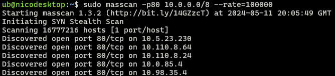
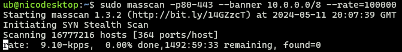

# masscan

[Home](../../../README.md)

### Links

* [Github](https://github.com/robertdavidgraham/masscan)
* [KaliTools](https://www.kali.org/tools/masscan/)

## Utilització

masscan -p[ports] ip/rang [Opcións]

### Paràmetres Comúns
- `-p <ports>` :Ports a escanejar, poden ser individuals, separats per comes: `80,443` o rangs separats per guions: `22-1024`.
- `--banners` :Intenta agarrar informació del banner del servei.
- `--source-port <port>` :Port d'origen.
- `--max-rate <nº>` :Quantitat màxima de paquets per segon enviats.
- `-oX <arxiu>` :Dirigim sortida a un arxiu .xml.
- `-oG <arxiu` :Dirigim sortida a un arxiu amb format grepable.

### Exemples d'ús:

 - Escaneig del port 80, la subnet `10.0.0.0/8` amb un límit de 100.000 pps:

   

 - Escaneig dels ports 80 al 443, agarrant banners de la subnet `10.0.0.0/8` amb un límit de 100.000 pps.

   