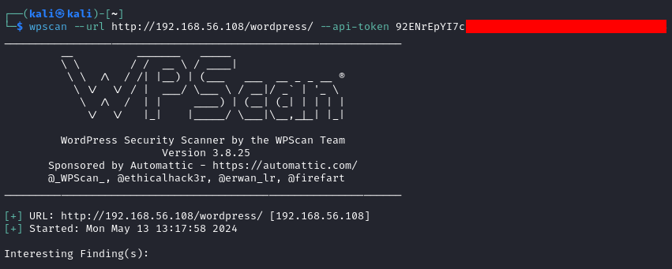
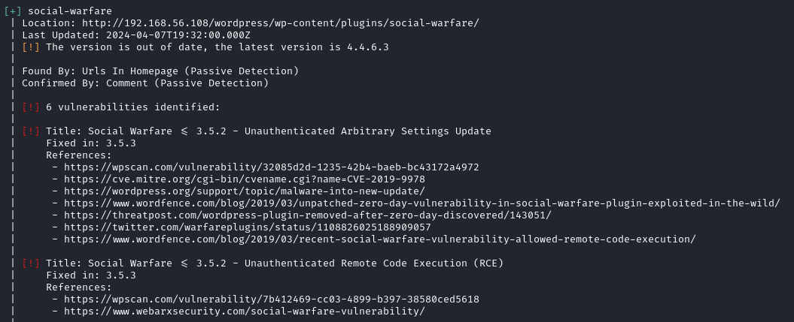

# WpScan

[Home](../../../README.md)

[KaliTools](https://www.kali.org/tools/netcat/)

## Utilització

Pots utilitzar wpscan sense registrar-te pero idealment utilitzaríes una api key per poder detectar versións i vulnerabilitats d'extensions.

[Link de registre](https://wpscan.com/register/)

Podem utilitzar correus temporals com aquest: [Link](https://temp-mail.org/)

### Paràmetres Comúns
S'utilitzen en combinació per escoltar en un port determinat.
 - `-u` :Utilitzem el mode UDP.

### Exemples d'ús

 - Escaneig d'un servei amb una api key:

   

 - Aqui una part del resultat:
   
   