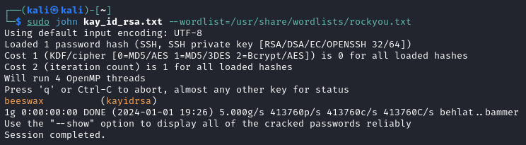
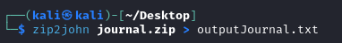

# John the Ripper

[Home](../../../README.md)

[KaliTools](https://www.kali.org/tools/john/)

## Utilització

john --wordlist=[fitxer] hash

### Paràmetres Comúns
 - `--wordlist=[arxiu]` :Indiquem una wordlist per fer l'atac.
 - `--fork=[nº]` :Indica el nombre de processos que crearà, pot ajudar en rendiment.
 - `--single` :Indica que només s'utilitzarà un core.

## Subprogrames

Johh the Ripper conté programes que podem utilitzar per extreure el hash d'algúns arxius, aquests són alguns dús comú:

 - `dmg2john<arxiu>`
 - `gpg2john <arxiu>`
 - `hccap2john <arxiu>`
 - `rar2john <arxiu>`
 - `zip2john <arxiu>`
 - `7z2john <arxiu>`
 - `hccapx2john <arxiu>`
 - `mozilla2john <arxiu>`
 - `openssl2john <arxiu>`
 - `pdf2john <arxiu>`
 - `ssh2john <arxiu>`
 - `vdi2john <arxiu>`

### Exemples d'ús:

 - Exemple crack d'una id_rsa ssh amb la wordlist "rockyou":

   

 - Exemple de com extraure el has d'un zip a un arxiu:

   