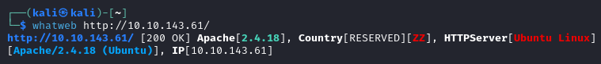
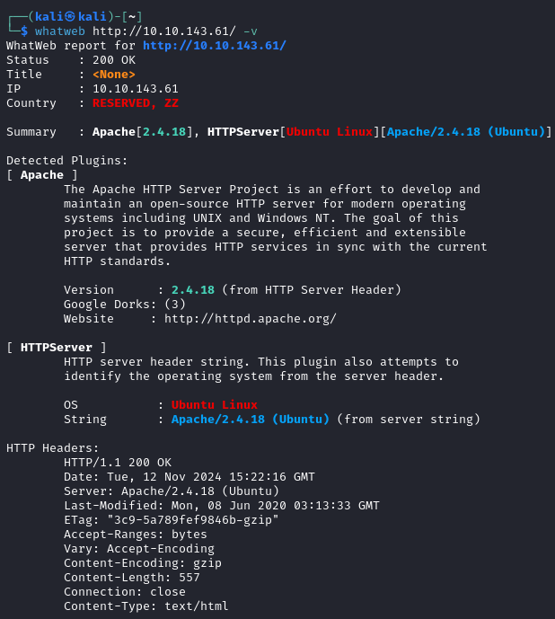

# nmap

[Home](../../../README.md)

### Links

* [GitHub](https://github.com/urbanadventurer/WhatWeb)
* [KaliTools](https://www.kali.org/tools/whatweb/)

## Utilització

Usage: whatweb [options] [URLs]

### Paràmetres Comuns

- `-v` :Mode verbose, mostra més informació.
- `--user, -u=<user:password>` :Autenticació HTML bàsica.
- `--proxy <hostname[:port]>` :Configura el proxy amb el port, per defecte port 8080.
- `-a<level>` :Epecifiquem el nivell d'agressivitat, 1, 3 o 4.
- `-A` :Utilizem un user-agent aleatori

### Exemples d'ús:

- Exemple d'un escaneig normal:

    

- Exemple d'un escaneig amb mode verbose:

    