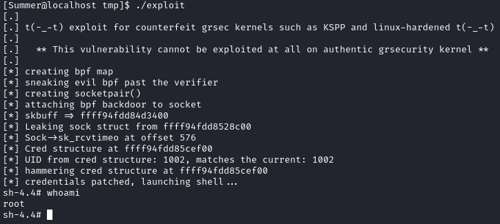

# Linux Kernel < 4.13.9 (Ubuntu 16.04 / Fedora 27) - Local Privilege Escalation

- [GitHub](https://github.com/brl/grlh/tree/master)
- [ExploitDB](https://www.exploit-db.com/exploits/45010)
- [Download](./45010.c)

Tested on Ubuntu 16.04:

* 4.4.0-31-generic
* 4.4.0-62-generic
* 4.4.0-81-generic
* 4.4.0-116-generic
* 4.8.0-58-generic
* 4.10.0.42-generic
* 4.13.0-21-generic

<br>

Tested on Fedora 27

* 4.13.9-300

### Compilació

```
gcc -static 45010.c -o exploit
```


### Execució

