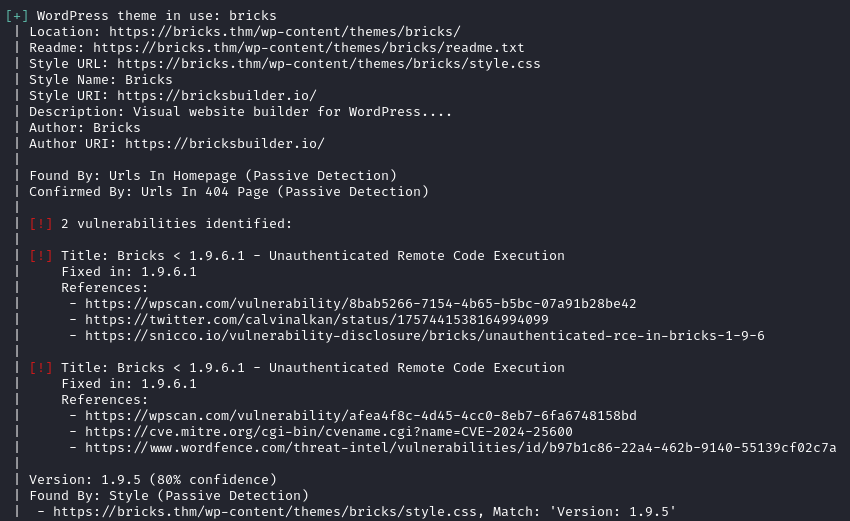

# Wordpress theme bricks <=1.9.6 - Remote Shell

- [GitHub](https://github.com/K3ysTr0K3R/CVE-2024-25600-EXPLOIT)
- [Rapid7](https://www.rapid7.com/db/modules/exploit/multi/http/wp_bricks_builder_rce/)
- [Download](./exploit/)

Tested on briks 1.9.5

### Comprobació

Comprobarém la versió del versió del tema bricks amb l'eina [wpscan](../../../../eines/Analisis_Enumeracio_Web/wpscan/wpscan.md)

### Execució

Clonarem el repositori de github i instal·larem els requisits amb `pip -r requirements.txt`

I executarém l'exploit amb `python3 exploit.py --url [url pagina wordpress]`

Podem veure que estem com a usuari apache dintre de la màquina servidor:

