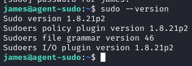
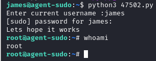

# Sudo < 1.8.28 - sudo Privilege Escalation

- [GitHub](https://github.com/0xGabe/Sudo-1.8.27)
- [ExploitDB](https://www.exploit-db.com/exploits/47502)
- [Download](./exploit/47502.py)

Tested on sudo < 1.8.28

### Comprobació

Comprobarém la versió del versió de sudo

### Execució

Executarém l'exploit amb python, li donem l'usuari actual i la seva contrasenya, després comprobem que tenim accés a l'usuari root.

